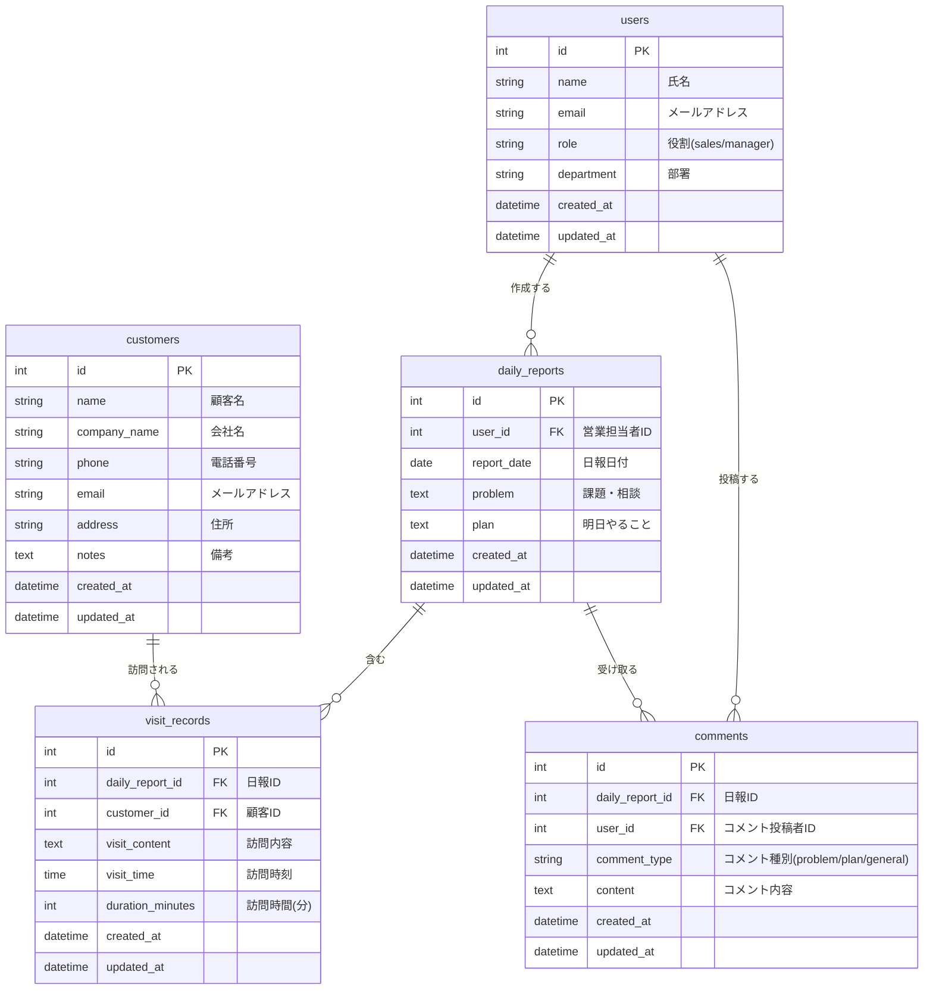

# ER図

## テーブル詳細仕様

### users（営業マスタ）

| カラム名   | 型                       | 制約             | 説明           |
| ---------- | ------------------------ | ---------------- | -------------- |
| id         | INT                      | PRIMARY KEY      | ユーザーID     |
| name       | VARCHAR(100)             | NOT NULL         | 氏名           |
| email      | VARCHAR(255)             | UNIQUE, NOT NULL | メールアドレス |
| role       | ENUM('sales', 'manager') | NOT NULL         | 役割           |
| department | VARCHAR(100)             |                  | 部署           |
| created_at | TIMESTAMP                |                  | 作成日時       |
| updated_at | TIMESTAMP                |                  | 更新日時       |

### customers（顧客マスタ）

| カラム名     | 型           | 制約        | 説明           |
| ------------ | ------------ | ----------- | -------------- |
| id           | INT          | PRIMARY KEY | 顧客ID         |
| name         | VARCHAR(100) | NOT NULL    | 顧客名         |
| company_name | VARCHAR(200) | NOT NULL    | 会社名         |
| phone        | VARCHAR(20)  |             | 電話番号       |
| email        | VARCHAR(255) |             | メールアドレス |
| address      | TEXT         |             | 住所           |
| notes        | TEXT         |             | 備考           |
| created_at   | TIMESTAMP    |             | 作成日時       |
| updated_at   | TIMESTAMP    |             | 更新日時       |

### daily_reports（日報）

| カラム名    | 型        | 制約                  | 説明         |
| ----------- | --------- | --------------------- | ------------ |
| id          | INT       | PRIMARY KEY           | 日報ID       |
| user_id     | INT       | FOREIGN KEY, NOT NULL | 営業担当者ID |
| report_date | DATE      | NOT NULL              | 日報日付     |
| problem     | TEXT      |                       | 課題・相談   |
| plan        | TEXT      |                       | 明日やること |
| created_at  | TIMESTAMP |                       | 作成日時     |
| updated_at  | TIMESTAMP |                       | 更新日時     |

**複合ユニーク制約**: (user_id, report_date) - 1人の営業が同じ日に複数の日報を作成できないようにする

### visit_records（訪問記録）

| カラム名         | 型        | 制約                  | 説明           |
| ---------------- | --------- | --------------------- | -------------- |
| id               | INT       | PRIMARY KEY           | 訪問記録ID     |
| daily_report_id  | INT       | FOREIGN KEY, NOT NULL | 日報ID         |
| customer_id      | INT       | FOREIGN KEY, NOT NULL | 顧客ID         |
| visit_content    | TEXT      | NOT NULL              | 訪問内容       |
| visit_time       | TIME      |                       | 訪問時刻       |
| duration_minutes | INT       |                       | 訪問時間（分） |
| created_at       | TIMESTAMP |                       | 作成日時       |
| updated_at       | TIMESTAMP |                       | 更新日時       |

### comments（コメント）

| カラム名        | 型                                 | 制約                  | 説明             |
| --------------- | ---------------------------------- | --------------------- | ---------------- |
| id              | INT                                | PRIMARY KEY           | コメントID       |
| daily_report_id | INT                                | FOREIGN KEY, NOT NULL | 日報ID           |
| user_id         | INT                                | FOREIGN KEY, NOT NULL | コメント投稿者ID |
| comment_type    | ENUM('problem', 'plan', 'general') | NOT NULL              | コメント種別     |
| content         | TEXT                               | NOT NULL              | コメント内容     |
| created_at      | TIMESTAMP                          |                       | 作成日時         |
| updated_at      | TIMESTAMP                          |                       | 更新日時         |
