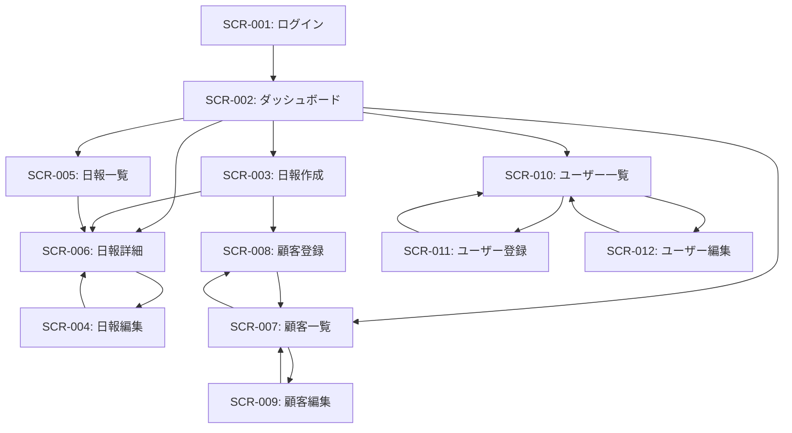

# 営業日報システム 画面定義書

## 画面一覧

| 画面ID  | 画面名           | URL                   | アクセス権限           |
| ------- | ---------------- | --------------------- | ---------------------- |
| SCR-001 | ログイン画面     | `/login`              | 全ユーザー             |
| SCR-002 | ダッシュボード   | `/`                   | 認証済みユーザー       |
| SCR-003 | 日報作成画面     | `/reports/new`        | 営業                   |
| SCR-004 | 日報編集画面     | `/reports/:id/edit`   | 営業（自分の日報のみ） |
| SCR-005 | 日報一覧画面     | `/reports`            | 全ユーザー             |
| SCR-006 | 日報詳細画面     | `/reports/:id`        | 全ユーザー             |
| SCR-007 | 顧客一覧画面     | `/customers`          | 全ユーザー             |
| SCR-008 | 顧客登録画面     | `/customers/new`      | 全ユーザー             |
| SCR-009 | 顧客編集画面     | `/customers/:id/edit` | 全ユーザー             |
| SCR-010 | ユーザー一覧画面 | `/users`              | 上長                   |
| SCR-011 | ユーザー登録画面 | `/users/new`          | 上長                   |
| SCR-012 | ユーザー編集画面 | `/users/:id/edit`     | 上長                   |

---

## SCR-001: ログイン画面

### 画面概要

システムへのログインを行う画面

### レイアウト

```
┌─────────────────────────────────┐
│     営業日報システム             │
│                                 │
│  ┌───────────────────────┐      │
│  │ メールアドレス         │      │
│  │ [___________________] │      │
│  │                       │      │
│  │ パスワード            │      │
│  │ [___________________] │      │
│  │                       │      │
│  │      [ログイン]        │      │
│  └───────────────────────┘      │
└─────────────────────────────────┘
```

### 画面項目

| 項目名         | 項目ID   | 種別           | 必須 | バリデーション |
| -------------- | -------- | -------------- | ---- | -------------- |
| メールアドレス | email    | テキスト入力   | ○    | メール形式     |
| パスワード     | password | パスワード入力 | ○    | 8文字以上      |

### アクション

| ボタン名 | 処理内容                                                |
| -------- | ------------------------------------------------------- |
| ログイン | 認証処理を実行し、成功時はダッシュボード(SCR-002)へ遷移 |

### 画面遷移

- ログイン成功 → SCR-002: ダッシュボード

---

## SCR-002: ダッシュボード

### 画面概要

ログイン後の初期画面。今日の日報状況と最近のアクティビティを表示

### レイアウト

```
┌─────────────────────────────────────────────┐
│ [ロゴ] 営業日報システム    [ユーザー名▼]    │
├─────────────────────────────────────────────┤
│ 📊 ダッシュボード                           │
├─────────────────────────────────────────────┤
│                                             │
│ ◆ 今日の日報                                │
│  ┌──────────────────────────┐               │
│  │ 2025-12-18                │               │
│  │ 状態: [未作成/作成済み]   │               │
│  │ [日報を作成] [日報を見る] │               │
│  └──────────────────────────┘               │
│                                             │
│ ◆ 最近の日報一覧                            │
│  ┌─────────────────────────────────┐        │
│  │ 日付       │状態    │訪問件数│コメント│ │
│  ├─────────────────────────────────┤        │
│  │ 2025-12-17 │完了    │ 3件    │ 1件    │ │
│  │ 2025-12-16 │完了    │ 2件    │ 0件    │ │
│  │ 2025-12-15 │完了    │ 4件    │ 2件    │ │
│  └─────────────────────────────────┘        │
│                     [もっと見る]            │
│                                             │
│ 【上長のみ表示】                            │
│ ◆ 承認待ち日報                              │
│  ┌─────────────────────────────────┐        │
│  │ 営業名    │日付      │訪問件数│         │
│  ├─────────────────────────────────┤        │
│  │ 山田太郎  │2025-12-18│ 2件    │[確認]  │ │
│  │ 佐藤花子  │2025-12-18│ 3件    │[確認]  │ │
│  └─────────────────────────────────┘        │
└─────────────────────────────────────────────┘
```

### 表示内容

#### 全ユーザー共通

- 今日の日報作成状況
- 自分の最近の日報一覧（直近10件）

#### 上長のみ

- 配下メンバーの承認待ち日報一覧

### アクション

| ボタン名   | 処理内容                          |
| ---------- | --------------------------------- |
| 日報を作成 | SCR-003: 日報作成画面へ遷移       |
| 日報を見る | SCR-006: 日報詳細画面へ遷移       |
| 確認       | 該当日報の詳細画面(SCR-006)へ遷移 |
| もっと見る | SCR-005: 日報一覧画面へ遷移       |

---

## SCR-003: 日報作成画面

### 画面概要

新規日報を作成する画面

### レイアウト

```
┌──────────────────────────────────────────────┐
│ [ロゴ] 営業日報システム     [ユーザー名▼]    │
├──────────────────────────────────────────────┤
│ 📝 日報作成                                  │
├──────────────────────────────────────────────┤
│                                              │
│ ■ 基本情報                                   │
│  日付: [2025-12-18▼]                         │
│                                              │
│ ■ 訪問記録                                   │
│  ┌─────────────────────────────────────┐     │
│  │ 訪問1                              [×]│     │
│  │ 顧客: [顧客を選択▼] [新規登録]          │     │
│  │ 訪問時刻: [14:00]                       │     │
│  │ 訪問時間: [60]分                        │     │
│  │ 訪問内容:                               │     │
│  │ ┌─────────────────────────────┐       │     │
│  │ │                               │       │     │
│  │ │                               │       │     │
│  │ └─────────────────────────────┘       │     │
│  └─────────────────────────────────────┘     │
│                                              │
│  [+ 訪問記録を追加]                          │
│                                              │
│ ■ 課題・相談 (Problem)                       │
│  ┌──────────────────────────────────┐        │
│  │                                  │        │
│  │                                  │        │
│  │                                  │        │
│  └──────────────────────────────────┘        │
│                                              │
│ ■ 明日やること (Plan)                        │
│  ┌──────────────────────────────────┐        │
│  │                                  │        │
│  │                                  │        │
│  │                                  │        │
│  └──────────────────────────────────┘        │
│                                              │
│          [下書き保存]  [提出]                │
│                                              │
└──────────────────────────────────────────────┘
```

### 画面項目

#### 基本情報

| 項目名 | 項目ID      | 種別     | 必須 | デフォルト値 | バリデーション      |
| ------ | ----------- | -------- | ---- | ------------ | ------------------- |
| 日付   | report_date | 日付選択 | ○    | 今日の日付   | 過去1週間〜今日まで |

#### 訪問記録（繰り返し項目）

| 項目名   | 項目ID           | 種別             | 必須 | バリデーション          |
| -------- | ---------------- | ---------------- | ---- | ----------------------- |
| 顧客     | customer_id      | セレクトボックス | ○    | 顧客マスタから選択      |
| 訪問時刻 | visit_time       | 時刻入力         | -    | HH:MM形式               |
| 訪問時間 | duration_minutes | 数値入力         | -    | 1以上の整数             |
| 訪問内容 | visit_content    | テキストエリア   | ○    | 1文字以上、1000文字以内 |

#### その他

| 項目名       | 項目ID  | 種別           | 必須 | バリデーション |
| ------------ | ------- | -------------- | ---- | -------------- |
| 課題・相談   | problem | テキストエリア | -    | 2000文字以内   |
| 明日やること | plan    | テキストエリア | -    | 2000文字以内   |

### アクション

| ボタン名       | 処理内容                                      |
| -------------- | --------------------------------------------- |
| 訪問記録を追加 | 訪問記録入力フォームを追加（最大10件）        |
| × (削除)       | 該当の訪問記録を削除                          |
| 顧客を選択     | 顧客マスタから顧客を検索・選択                |
| 新規登録       | SCR-008: 顧客登録画面をモーダルで開く         |
| 下書き保存     | バリデーションなしで保存し、ダッシュボードへ  |
| 提出           | バリデーション後、日報を提出してSCR-006へ遷移 |

### バリデーション

#### 提出時の必須チェック

- 訪問記録が1件以上存在すること
- 各訪問記録で顧客と訪問内容が入力されていること
- 同じ日付の日報が既に存在しないこと

#### エラーメッセージ

- 「訪問記録を少なくとも1件追加してください」
- 「顧客を選択してください」
- 「訪問内容を入力してください」
- 「この日付の日報は既に登録されています」

---

## SCR-004: 日報編集画面

### 画面概要

既存の日報を編集する画面（レイアウトはSCR-003とほぼ同じ）

### 差分

- タイトルが「日報編集」
- 既存データが入力済みの状態で表示
- 日付は変更不可（表示のみ）
- 「削除」ボタンを追加

### アクション

| ボタン名 | 処理内容                                             |
| -------- | ---------------------------------------------------- |
| 削除     | 確認ダイアログ表示後、日報を削除してダッシュボードへ |
| 更新     | バリデーション後、日報を更新してSCR-006へ遷移        |

---

## SCR-005: 日報一覧画面

### 画面概要

日報の一覧を表示し、検索・絞り込みを行う画面

### レイアウト

```
┌──────────────────────────────────────────────┐
│ [ロゴ] 営業日報システム     [ユーザー名▼]    │
├──────────────────────────────────────────────┤
│ 📋 日報一覧                   [新規作成]     │
├──────────────────────────────────────────────┤
│                                              │
│ ■ 検索条件                                   │
│  営業: [全員▼] ※上長のみ                    │
│  期間: [2025-12-01] 〜 [2025-12-31]          │
│  顧客: [全顧客▼]                             │
│         [検索] [クリア]                      │
│                                              │
│ ■ 検索結果: 25件                             │
│  ┌───────────────────────────────────────┐   │
│  │日付      │営業    │訪問件数│コメント│   │   │
│  ├───────────────────────────────────────┤   │
│  │2025-12-18│山田太郎│  3件   │  1件  │[詳細]│   │
│  │2025-12-18│佐藤花子│  2件   │  0件  │[詳細]│   │
│  │2025-12-17│山田太郎│  4件   │  2件  │[詳細]│   │
│  │2025-12-17│佐藤花子│  1件   │  1件  │[詳細]│   │
│  │2025-12-16│山田太郎│  2件   │  0件  │[詳細]│   │
│  │...                                      │   │
│  └───────────────────────────────────────┘   │
│                                              │
│         [前へ] 1 2 3 4 5 [次へ]              │
│                                              │
└──────────────────────────────────────────────┘
```

### 画面項目

#### 検索条件

| 項目名       | 項目ID      | 種別             | 必須 | 説明                         |
| ------------ | ----------- | ---------------- | ---- | ---------------------------- |
| 営業         | user_id     | セレクトボックス | -    | 上長のみ表示。営業は自分のみ |
| 期間（開始） | date_from   | 日付入力         | -    | デフォルト: 当月1日          |
| 期間（終了） | date_to     | 日付入力         | -    | デフォルト: 今日             |
| 顧客         | customer_id | セレクトボックス | -    | 全顧客または特定顧客         |

#### 一覧表示項目

- 日付
- 営業名（上長のみ表示）
- 訪問件数
- コメント件数
- 詳細ボタン

### アクション

| ボタン名 | 処理内容                           |
| -------- | ---------------------------------- |
| 新規作成 | SCR-003: 日報作成画面へ遷移        |
| 検索     | 検索条件に基づいて一覧を絞り込み   |
| クリア   | 検索条件をクリアしてデフォルト表示 |
| 詳細     | SCR-006: 該当日報の詳細画面へ遷移  |

### 表示仕様

- ページネーション: 20件/ページ
- デフォルトソート: 日付降順
- 営業ユーザー: 自分の日報のみ表示
- 上長: 全メンバーの日報を表示可能

---

## SCR-006: 日報詳細画面

### 画面概要

日報の詳細内容を表示し、上長がコメントを追加できる画面

### レイアウト

```
┌──────────────────────────────────────────────┐
│ [ロゴ] 営業日報システム     [ユーザー名▼]    │
├──────────────────────────────────────────────┤
│ 📄 日報詳細                                  │
│                    [編集] [削除] ※本人のみ   │
├──────────────────────────────────────────────┤
│                                              │
│ ■ 基本情報                                   │
│  営業: 山田太郎                              │
│  日付: 2025-12-18                            │
│  作成日時: 2025-12-18 18:30                  │
│                                              │
│ ■ 訪問記録                                   │
│  ┌─────────────────────────────────────┐     │
│  │ 訪問1                                   │     │
│  │ 顧客: 株式会社ABC (田中一郎様)          │     │
│  │ 訪問時刻: 14:00                         │     │
│  │ 訪問時間: 60分                          │     │
│  │ 訪問内容:                               │     │
│  │ 新商品の提案を実施。好感触で、          │     │
│  │ 次回見積提示の約束を取り付けた。        │     │
│  └─────────────────────────────────────┘     │
│  ┌─────────────────────────────────────┐     │
│  │ 訪問2                                   │     │
│  │ 顧客: XYZ商事株式会社 (鈴木次郎様)      │     │
│  │ ...                                     │     │
│  └─────────────────────────────────────┘     │
│                                              │
│ ■ 課題・相談 (Problem)                       │
│  ┌──────────────────────────────────┐        │
│  │ ABC社の決裁フローが長く、               │        │
│  │ 受注までの期間短縮方法を相談したい。    │        │
│  └──────────────────────────────────┘        │
│                                              │
│  💬 コメント (1件)                           │
│  ┌──────────────────────────────────┐        │
│  │ [上長] 佐藤部長 2025-12-18 19:00        │        │
│  │ キーマンを特定して直接アプローチを      │        │
│  │ 検討しましょう。                        │        │
│  └──────────────────────────────────┘        │
│                                              │
│  ※上長のみ表示                              │
│  ┌──────────────────────────────────┐        │
│  │ コメントを追加:                         │        │
│  │ [________________________]              │        │
│  │                    [コメント送信]       │        │
│  └──────────────────────────────────┘        │
│                                              │
│ ■ 明日やること (Plan)                        │
│  ┌──────────────────────────────────┐        │
│  │ ・ABC社のキーマンリサーチ               │        │
│  │ ・XYZ商事への見積書作成                 │        │
│  └──────────────────────────────────┘        │
│                                              │
│  💬 コメント (0件)                           │
│                                              │
│  ※上長のみ表示                              │
│  ┌──────────────────────────────────┐        │
│  │ コメントを追加:                         │        │
│  │ [________________________]              │        │
│  │                    [コメント送信]       │        │
│  └──────────────────────────────────┘        │
│                                              │
│                      [戻る]                  │
└──────────────────────────────────────────────┘
```

### 表示項目

#### 基本情報

- 営業名
- 日付
- 作成日時
- 最終更新日時

#### 訪問記録

- 顧客名（会社名 + 担当者名）
- 訪問時刻
- 訪問時間
- 訪問内容

#### 課題・相談 / 明日やること

- 本文
- コメント一覧（投稿者、日時、内容）
- コメント入力フォーム（上長のみ）

### アクション

| ボタン名     | 処理内容                                   | 表示条件 |
| ------------ | ------------------------------------------ | -------- |
| 編集         | SCR-004: 日報編集画面へ遷移                | 本人のみ |
| 削除         | 確認ダイアログ表示後、削除                 | 本人のみ |
| コメント送信 | コメントを保存し、画面を再表示             | 上長のみ |
| 戻る         | 前の画面（一覧またはダッシュボード）へ戻る | 全員     |

### バリデーション

- コメント: 1文字以上、500文字以内

---

## SCR-007: 顧客一覧画面

### 画面概要

登録済み顧客の一覧を表示し、検索・編集を行う画面

### レイアウト

```
┌──────────────────────────────────────────────┐
│ [ロゴ] 営業日報システム     [ユーザー名▼]    │
├──────────────────────────────────────────────┤
│ 🏢 顧客一覧                   [新規登録]     │
├──────────────────────────────────────────────┤
│                                              │
│ ■ 検索条件                                   │
│  キーワード: [__________] (会社名・顧客名)   │
│              [検索] [クリア]                 │
│                                              │
│ ■ 検索結果: 50件                             │
│  ┌────────────────────────────────────┐      │
│  │会社名        │顧客名  │電話番号    │      │      │
│  ├────────────────────────────────────┤      │
│  │株式会社ABC   │田中一郎│03-1234-5678│[編集]│      │
│  │XYZ商事株式会社│鈴木次郎│03-2345-6789│[編集]│      │
│  │DEF工業株式会社│山本三郎│06-3456-7890│[編集]│      │
│  │...                                    │      │
│  └────────────────────────────────────┘      │
│                                              │
│         [前へ] 1 2 3 [次へ]                  │
│                                              │
└──────────────────────────────────────────────┘
```

### 画面項目

#### 検索条件

| 項目名     | 項目ID  | 種別         | 説明                         |
| ---------- | ------- | ------------ | ---------------------------- |
| キーワード | keyword | テキスト入力 | 会社名・顧客名で部分一致検索 |

#### 一覧表示項目

- 会社名
- 顧客名
- 電話番号
- メールアドレス
- 編集ボタン

### アクション

| ボタン名 | 処理内容                          |
| -------- | --------------------------------- |
| 新規登録 | SCR-008: 顧客登録画面へ遷移       |
| 検索     | キーワードで顧客を検索            |
| クリア   | 検索条件をクリア                  |
| 編集     | SCR-009: 該当顧客の編集画面へ遷移 |

### 表示仕様

- ページネーション: 20件/ページ
- デフォルトソート: 会社名昇順（50音順）

---

## SCR-008: 顧客登録画面

### 画面概要

新規顧客を登録する画面

### レイアウト

```
┌──────────────────────────────────────────────┐
│ [ロゴ] 営業日報システム     [ユーザー名▼]    │
├──────────────────────────────────────────────┤
│ 🏢 顧客登録                                  │
├──────────────────────────────────────────────┤
│                                              │
│ ■ 基本情報                                   │
│  会社名 *                                    │
│  [________________________________]          │
│                                              │
│  顧客名 *                                    │
│  [________________________________]          │
│                                              │
│  電話番号                                    │
│  [________________________________]          │
│                                              │
│  メールアドレス                              │
│  [________________________________]          │
│                                              │
│  住所                                        │
│  [________________________________]          │
│  [________________________________]          │
│                                              │
│  備考                                        │
│  ┌──────────────────────────────┐           │
│  │                              │           │
│  │                              │           │
│  │                              │           │
│  └──────────────────────────────┘           │
│                                              │
│          [キャンセル]  [登録]                │
│                                              │
└──────────────────────────────────────────────┘
```

### 画面項目

| 項目名         | 項目ID       | 種別           | 必須 | バリデーション                    |
| -------------- | ------------ | -------------- | ---- | --------------------------------- |
| 会社名         | company_name | テキスト入力   | ○    | 1〜200文字                        |
| 顧客名         | name         | テキスト入力   | ○    | 1〜100文字                        |
| 電話番号       | phone        | テキスト入力   | -    | 電話番号形式（ハイフンあり/なし） |
| メールアドレス | email        | テキスト入力   | -    | メール形式                        |
| 住所           | address      | テキストエリア | -    | 500文字以内                       |
| 備考           | notes        | テキストエリア | -    | 1000文字以内                      |

### アクション

| ボタン名   | 処理内容                                      |
| ---------- | --------------------------------------------- |
| キャンセル | 確認なしで前の画面へ戻る                      |
| 登録       | バリデーション後、顧客を登録してSCR-007へ遷移 |

---

## SCR-009: 顧客編集画面

### 画面概要

既存顧客の情報を編集する画面（レイアウトはSCR-008と同じ）

### 差分

- タイトルが「顧客編集」
- 既存データが入力済みの状態で表示
- 「削除」ボタンを追加

### アクション

| ボタン名 | 処理内容                                                       |
| -------- | -------------------------------------------------------------- |
| 削除     | 確認ダイアログ表示後、顧客を削除 ※日報で使用中の場合は削除不可 |
| 更新     | バリデーション後、顧客情報を更新してSCR-007へ遷移              |

---

## SCR-010: ユーザー一覧画面

### 画面概要

登録済みユーザー（営業・上長）の一覧を表示（上長のみアクセス可能）

### レイアウト

```
┌──────────────────────────────────────────────┐
│ [ロゴ] 営業日報システム     [ユーザー名▼]    │
├──────────────────────────────────────────────┤
│ 👥 ユーザー一覧               [新規登録]     │
├──────────────────────────────────────────────┤
│                                              │
│ ■ 検索条件                                   │
│  役割: [全員▼] (全員/営業/上長)             │
│  部署: [全部署▼]                             │
│       [検索] [クリア]                        │
│                                              │
│ ■ 検索結果: 15件                             │
│  ┌─────────────────────────────────────┐    │
│  │氏名      │メール          │役割│部署│      │    │
│  ├─────────────────────────────────────┤    │
│  │山田太郎  │yamada@example  │営業│営業部│[編集]│    │
│  │佐藤花子  │sato@example    │営業│営業部│[編集]│    │
│  │鈴木一郎  │suzuki@example  │上長│営業部│[編集]│    │
│  │...                                      │    │
│  └─────────────────────────────────────┘    │
│                                              │
└──────────────────────────────────────────────┘
```

### 画面項目

#### 検索条件

| 項目名 | 項目ID     | 種別             | 説明                 |
| ------ | ---------- | ---------------- | -------------------- |
| 役割   | role       | セレクトボックス | 全員/営業/上長       |
| 部署   | department | セレクトボックス | 登録済み部署から選択 |

#### 一覧表示項目

- 氏名
- メールアドレス
- 役割
- 部署
- 編集ボタン

### アクション

| ボタン名 | 処理内容                              |
| -------- | ------------------------------------- |
| 新規登録 | SCR-011: ユーザー登録画面へ遷移       |
| 検索     | 条件でユーザーを絞り込み              |
| クリア   | 検索条件をクリア                      |
| 編集     | SCR-012: 該当ユーザーの編集画面へ遷移 |

---

## SCR-011: ユーザー登録画面

### 画面概要

新規ユーザーを登録する画面（上長のみアクセス可能）

### レイアウト

```
┌──────────────────────────────────────────────┐
│ [ロゴ] 営業日報システム     [ユーザー名▼]    │
├──────────────────────────────────────────────┤
│ 👤 ユーザー登録                              │
├──────────────────────────────────────────────┤
│                                              │
│ ■ 基本情報                                   │
│  氏名 *                                      │
│  [________________________________]          │
│                                              │
│  メールアドレス *                            │
│  [________________________________]          │
│                                              │
│  パスワード *                                │
│  [________________________________]          │
│                                              │
│  役割 *                                      │
│  ( ) 営業  ( ) 上長                         │
│                                              │
│  部署                                        │
│  [________________________________]          │
│                                              │
│          [キャンセル]  [登録]                │
│                                              │
└──────────────────────────────────────────────┘
```

### 画面項目

| 項目名         | 項目ID     | 種別           | 必須 | バリデーション              |
| -------------- | ---------- | -------------- | ---- | --------------------------- |
| 氏名           | name       | テキスト入力   | ○    | 1〜100文字                  |
| メールアドレス | email      | テキスト入力   | ○    | メール形式、ユニーク        |
| パスワード     | password   | パスワード入力 | ○    | 8文字以上、英数字記号を含む |
| 役割           | role       | ラジオボタン   | ○    | 営業 or 上長                |
| 部署           | department | テキスト入力   | -    | 100文字以内                 |

### アクション

| ボタン名   | 処理内容                                          |
| ---------- | ------------------------------------------------- |
| キャンセル | 前の画面へ戻る                                    |
| 登録       | バリデーション後、ユーザーを登録してSCR-010へ遷移 |

---

## SCR-012: ユーザー編集画面

### 画面概要

既存ユーザーの情報を編集する画面（レイアウトはSCR-011と同じ）

### 差分

- タイトルが「ユーザー編集」
- 既存データが入力済みの状態で表示
- パスワードは「変更する場合のみ入力」
- 「削除」ボタンを追加

### アクション

| ボタン名 | 処理内容                                                           |
| -------- | ------------------------------------------------------------------ |
| 削除     | 確認ダイアログ表示後、ユーザーを削除 ※日報が存在する場合は削除不可 |
| 更新     | バリデーション後、ユーザー情報を更新してSCR-010へ遷移              |

---

## 共通ヘッダー・ナビゲーション

### ヘッダー構成

```
┌──────────────────────────────────────────────┐
│ [ロゴ] 営業日報システム     [ユーザー名▼]    │
└──────────────────────────────────────────────┘
```

### ナビゲーションメニュー（ドロップダウン）

- ダッシュボード
- 日報
  - 日報一覧
  - 日報作成
- 顧客
  - 顧客一覧
  - 顧客登録
- ユーザー管理（上長のみ）
  - ユーザー一覧
  - ユーザー登録
- ログアウト

---

## 画面遷移図



---

## レスポンシブ対応

### 対応デバイス

- デスクトップ（1024px以上）
- タブレット（768px〜1023px）
- スマートフォン（767px以下）

### スマートフォン表示時の考慮事項

- テーブルはカード形式で表示
- ナビゲーションはハンバーガーメニュー化
- 入力フォームは縦並びレイアウト
- 訪問記録はアコーディオン表示

---

## アクセシビリティ

### 対応項目

- キーボード操作対応
- ARIA属性の適切な使用
- 適切なコントラスト比の確保
- フォーカスインジケーターの明示
- スクリーンリーダー対応

---

## エラー処理

### エラー表示方法

- フォームエラー: 該当項目の下に赤文字で表示
- システムエラー: 画面上部にトーストで表示
- 権限エラー: エラーページへ遷移

### 主なエラーメッセージ

- 「必須項目を入力してください」
- 「不正な形式です」
- 「既に登録されています」
- 「権限がありません」
- 「通信エラーが発生しました」
- 「削除できません。関連データが存在します」

---

## パフォーマンス要件

- 画面表示: 2秒以内
- 検索処理: 3秒以内
- データ登録: 2秒以内
- ページネーション: スムーズな遷移

---

## ブラウザ対応

### 対応ブラウザ

- Google Chrome（最新版）
- Microsoft Edge（最新版）
- Firefox（最新版）
- Safari（最新版）
